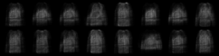

# Variational Autoencoder - FMNIST
Variational-Autoencoder on FMNIST dataset
erez
## Method:
We implemented Variational Autoencoder. 

*Semi-Supervised Learning with Deep Generative Models, DP. Kingma*,
In Neural Information Processing Systems, 2014. [paper](https://arxiv.org/abs/1406.5298)

Architecture details: (Based on M1 scheme in the paper)
* Input dimension: 784
* Hidden layers dimension: 600 (each) x Two layers
* latent size: 50
* Weights initialized same as the paper with `std=0.001`

We use the loss function:

 

To improve the results, we used *Disentangled Variational Encoder-Decoder* with `beta` parameter :

 

## Training:
* We used Fashin MNIST dataset.
* We train the model for 25 epochs.
* We set `beta=0.005`
* Optimization using adam algorithm, with `lr=0.001` and `wd=0.1`

 

  
  <i>Training loss on test set and train set.
</i>

## Classification:
We used SVM for classification (in the latent space).
We took only 100, 600, 1000 and 3000 samples to fit the SVM.
The rest used to test the performance:
 

  
   
 
  <i>AAA
</i>

 

   
  <i>GT and GEN
</i>

