# Variational Autoencoder - FMNIST
Variational-Autoencoder on FMNIST dataset
erez
## Method:
We implemented Variational-Autoencoder:
*Semi-Supervised Learning with Deep Generative Models, DP. Kingma*,
In Neural Information Processing Systems, 2014. [paper](https://arxiv.org/abs/1406.5298)

Architecture details: (Based on M1 scheme in the paper)
* Input dimension: 784
* Hidden layers dimension: 600 (each) x Two layers
* latent size: 50
* Weights initialized same as the paper with `std=0.001`

We use the loss function:

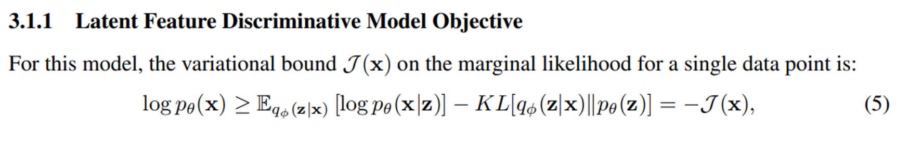 

To improve the results, we used *Disentangled Variational Encoder-Decoder* with `beta` parameter :

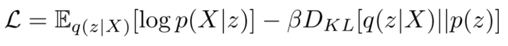 

## Training:
* We used Fashion MNIST dataset.
* We train the model for 25 epochs.
* We set `beta=0.005`
* Optimization using adam algorithm, with `lr=0.001` and `wd=0.1`

 

 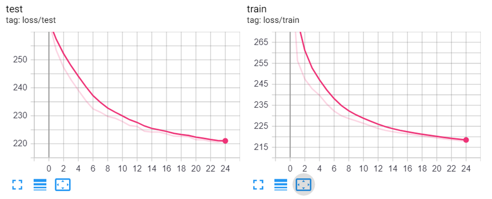 
  <i>Training loss on test set and train set.
</i>

## Classification:
We used SVM for classification (in the latent space).
We took only 100, 600, 1000 and 3000 samples to fit the SVM.
The rest used to test the performance:
 

 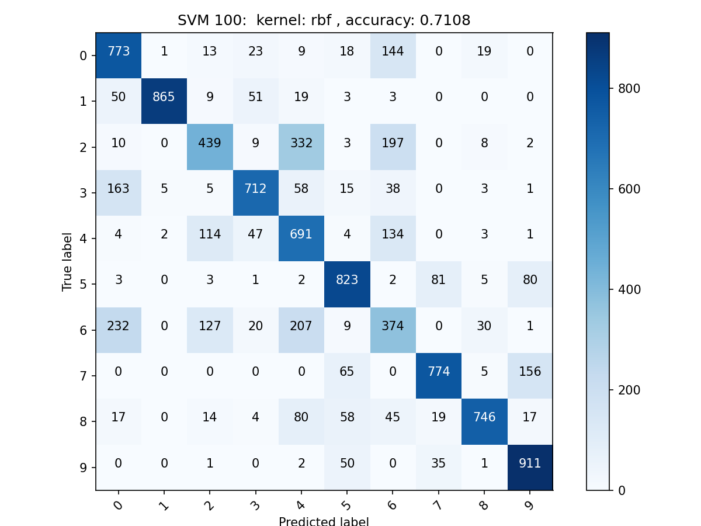 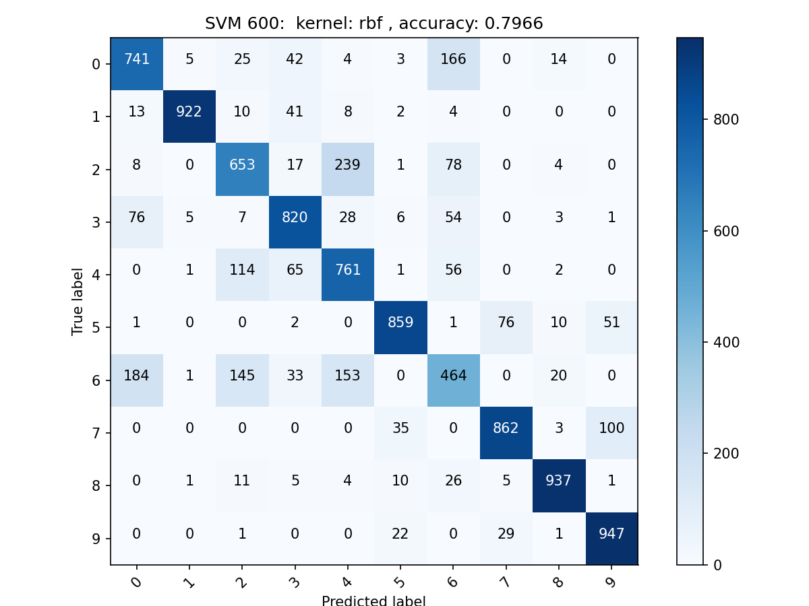
 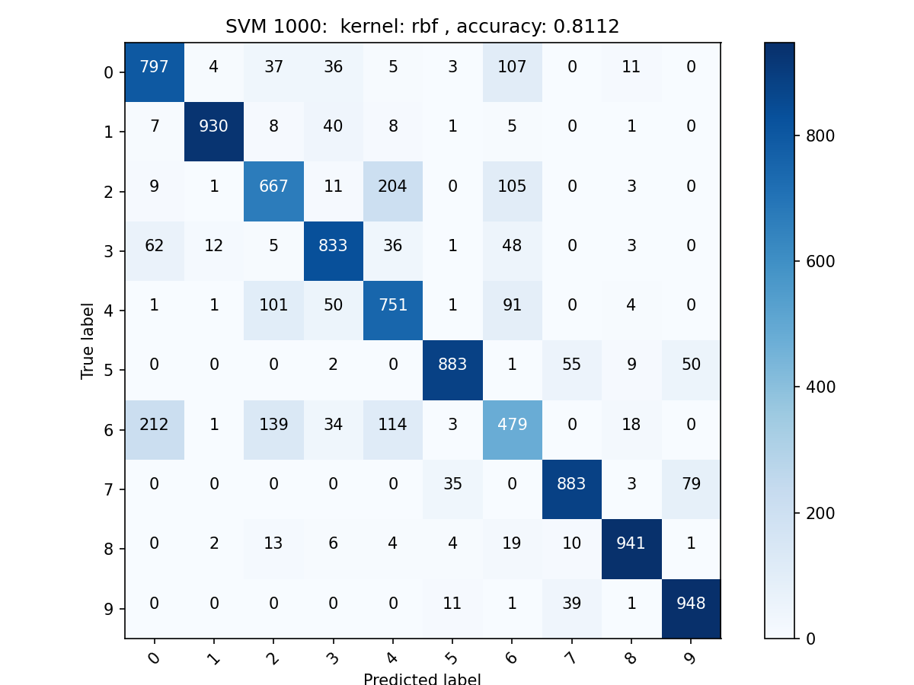 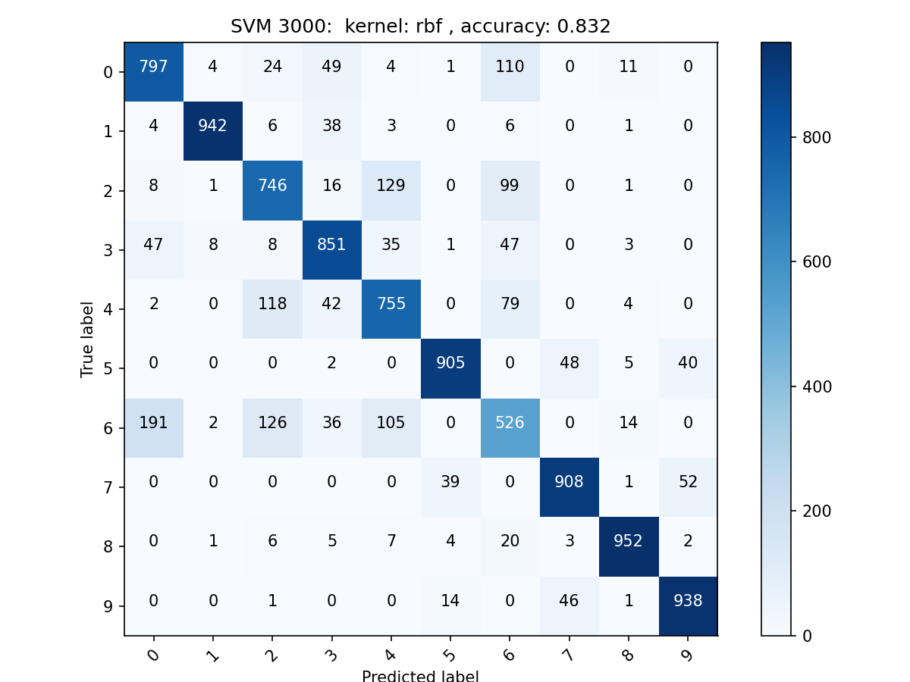  
  <i>Confusion Matrix, SVM classification with: 100,600,1000,3000 samples.
</i>

**Classification accuracy:**

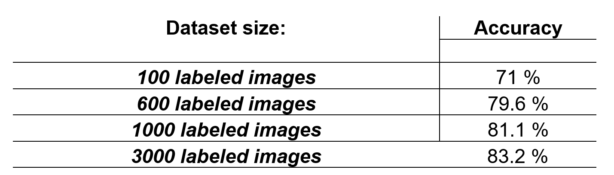

## Images Reconstruction:
The reconstructed images at the output of the *Decoder* with respect to the images input to the *Encoder*:

 

 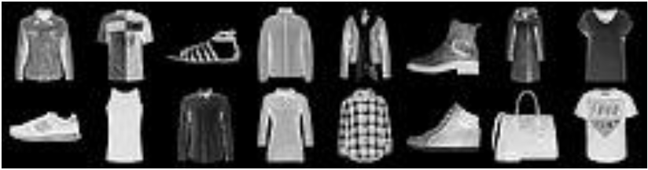 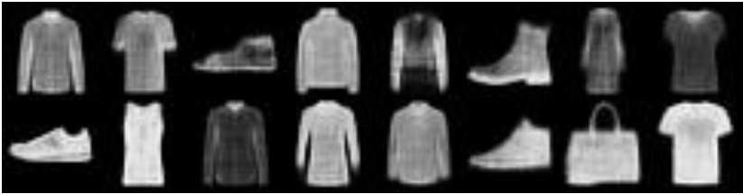  
  <i>Variational-Autoencoder Reconstruction: Encoder input (left) and Decoder output (right)
</i>

## Data Generation:
*Using Variational-Autoencoder we can generate new samples from the latent space:*
 
 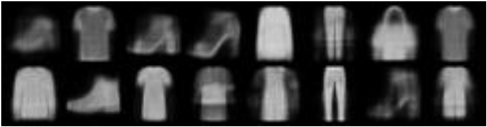 
  <i>New data semples by Variational-Autoencoder.
</i>

*Using classic Autoencoder, we cant generate samples from the latent space:*

 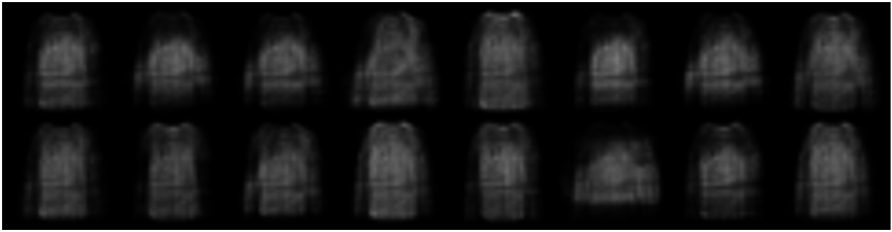 
  <i>New data semples by Autoencoder.
</i>

